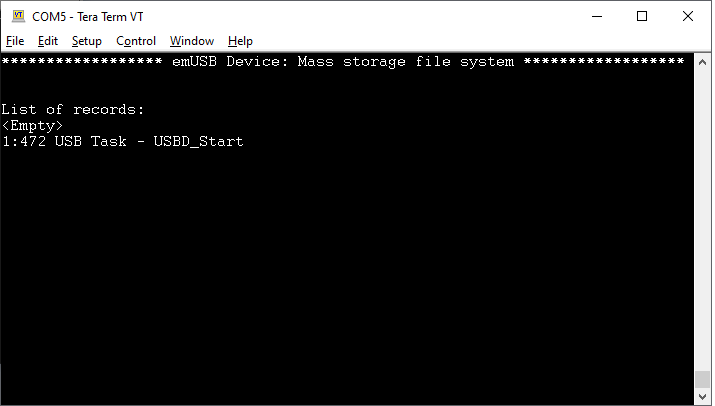
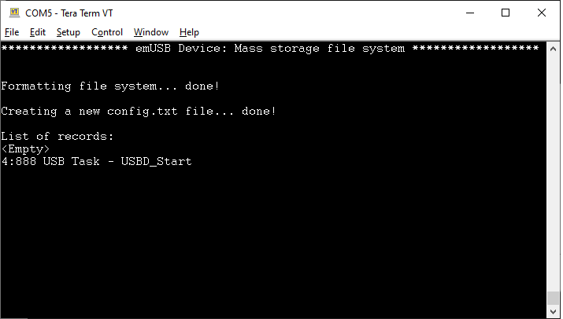
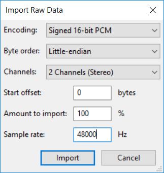
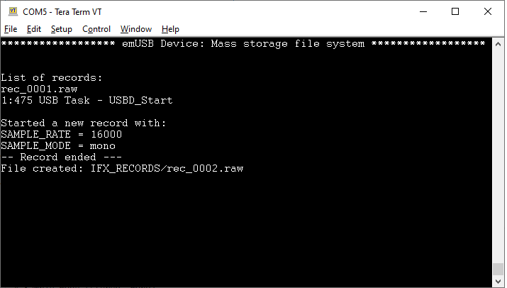
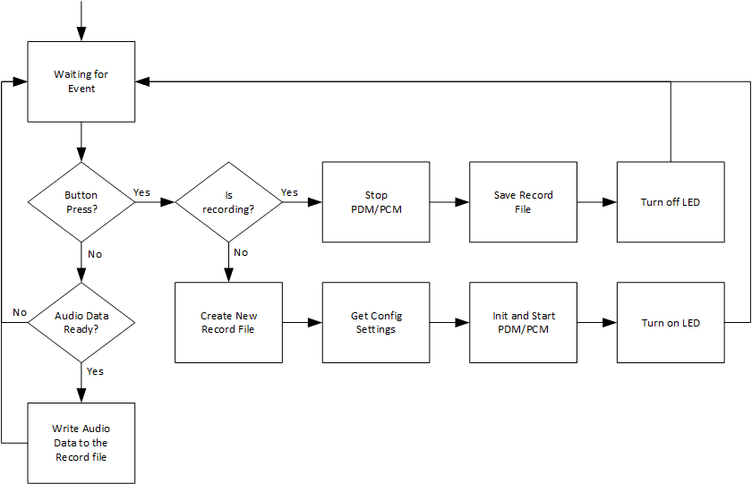

# emUSB Device: Mass storage file system

This example demonstrates the usage of Segger's emUSB-Device middleware to set up the USB block in an Infineon MCU as a Mass Storage Class (MSC) device and run the ([FatFs](http://elm-chan.org/fsw/ff/00index_e.html)) file system through an external memory (microSD). This example currently supports PSoC&trade; 6 and uses FreeRTOS.


[View this README on GitHub.](https://github.com/Infineon/mtb-example-usb-device-msc-filesystem-freertos)

[Provide feedback on this code example.](https://cypress.co1.qualtrics.com/jfe/form/SV_1NTns53sK2yiljn?Q_EED=eyJVbmlxdWUgRG9jIElkIjoiQ0UyMzY0NzQiLCJTcGVjIE51bWJlciI6IjAwMi0zNjQ3NCIsIkRvYyBUaXRsZSI6ImVtVVNCIERldmljZTogTWFzcyBzdG9yYWdlIGZpbGUgc3lzdGVtIiwicmlkIjoibWFqdW1kYXIiLCJEb2MgdmVyc2lvbiI6IjEuMS4wIiwiRG9jIExhbmd1YWdlIjoiRW5nbGlzaCIsIkRvYyBEaXZpc2lvbiI6Ik1DRCIsIkRvYyBCVSI6IklDVyIsIkRvYyBGYW1pbHkiOiJQU09DIn0=)

## Requirements


- [ModusToolbox&trade; software](https://www.infineon.com/modustoolbox) v3.1 or later (tested with v3.1)
- Board support package (BSP) minimum required version: 4.0.0
- Programming language: C
- Associated parts: All [PSoC&trade; 6 MCU](https://www.infineon.com/cms/en/product/microcontroller/32-bit-psoc-arm-cortex-microcontroller/psoc-6-32-bit-arm-cortex-m4-mcu) parts
## Supported toolchains (make variable 'TOOLCHAIN')

- GNU Arm&reg; embedded compiler v11.3.1 (`GCC_ARM`) - Default value of `TOOLCHAIN`
- Arm&reg; compiler v6.16 (`ARM`)
- IAR C/C++ compiler v9.30.1 (`IAR`)


## Supported kits (make variable 'TARGET')

- [PSoC&trade; 6 Wi-Fi Bluetooth&reg; Prototyping Kit](https://www.infineon.com/CY8CPROTO-062-4343W) (`CY8CPROTO-062-4343W`) – Default value of `TARGET`
- [PSoC&trade; 62S2 Wi-Fi Bluetooth&reg; Pioneer Kit](https://www.infineon.com/CY8CKIT-062S2-43012) (`CY8CKIT-062S2-43012`)
- [PSoC&trade; 62S2 Evaluation Kit](https://www.infineon.com/CY8CEVAL-062S2) (`CY8CEVAL-062S2`, `CY8CEVAL-062S2-LAI-4373M2`, `CY8CEVAL-062S2-MUR-43439M2`, `CY8CEVAL-062S2-LAI-43439M2`)
- [PSoC&trade; 6 Wi-Fi Bluetooth&reg; Prototyping Kit](https://www.infineon.com/CY8CPROTO-062S2-43439) (`CY8CPROTO-062S2-43439`)


## Hardware setup

This example uses the board's default configuration. See the kit user guide to ensure that the board is configured correctly.

When using CY8CKIT-062xx / CY8CKIT-064xxxx / CY8CEVAL-062xx series as the target, connect the PDM microphone externally on P10.5 and P10.4 pins. This can be done by plugging in the [CY8CKIT-028-EPD](https://www.infineon.com/cms/en/product/evaluation-boards/cy8ckit-028-epd) E-INK shield display board to the board’s compatible Arduino headers.

It also requires a microSD card placed in the SD card slot to properly run the file system.

**Note:** This CE supports the SD card of 8GB, 16GB, and 32GB capacity. The `CY8CPROTO-062-4343W` and the `CY8CPROTO-062S2-43439` kits currently support only the 8GB SD card.

## Software setup

Install a terminal emulator if you don't have one. Instructions in this document use [Tera Term](https://ttssh2.osdn.jp/index.html.en).

This example uses the [Audacity](https://www.audacityteam.org/) tool to import raw audio data stored in external memory. You can also use any software tool that can import raw audio data.


## Using the code example

Create the project and open it using one of the following:

<details><summary><b>In Eclipse IDE for ModusToolbox&trade; software</b></summary>

1. Click the **New Application** link in the **Quick Panel** (or, use **File** > **New** > **ModusToolbox&trade; Application**). This launches the [Project Creator](https://www.infineon.com/ModusToolboxProjectCreator) tool.

2. Pick a kit supported by the code example from the list shown in the **Project Creator - Choose Board Support Package (BSP)** dialog.

   When you select a supported kit, the example is reconfigured automatically to work with the kit. To work with a different supported kit later, use the [Library Manager](https://www.infineon.com/ModusToolboxLibraryManager) to choose the BSP for the supported kit. You can use the Library Manager to select or update the BSP and firmware libraries used in this application. To access the Library Manager, click the link from the **Quick Panel**.

   You can also just start the application creation process again and select a different kit.

   If you want to use the application for a kit not listed here, you may need to update the source files. If the kit does not have the required resources, the application may not work.

3. In the **Project Creator - Select Application** dialog, choose the example by enabling the checkbox.

4. (Optional) Change the suggested **New Application Name**.

5. The **Application(s) Root Path** defaults to the Eclipse workspace which is usually the desired location for the application. If you want to store the application in a different location, you can change the *Application(s) Root Path* value. Applications that share libraries should be in the same root path.

6. Click **Create** to complete the application creation process.

For more details, see the [Eclipse IDE for ModusToolbox&trade; software user guide](https://www.infineon.com/MTBEclipseIDEUserGuide) (locally available at *{ModusToolbox&trade; software install directory}/docs_{version}/mt_ide_user_guide.pdf*).

</details>

<details><summary><b>In command-line interface (CLI)</b></summary>

ModusToolbox&trade; software provides the Project Creator as both a GUI tool and the command line tool, "project-creator-cli". The CLI tool can be used to create applications from a CLI terminal or from within batch files or shell scripts. This tool is available in the *{ModusToolbox&trade; software install directory}/tools_{version}/project-creator/* directory.

Use a CLI terminal to invoke the "project-creator-cli" tool. On Windows, use the command line "modus-shell" program provided in the ModusToolbox&trade; software installation instead of a standard Windows command-line application. This shell provides access to all ModusToolbox&trade; software tools. You can access it by typing `modus-shell` in the search box in the Windows menu. In Linux and macOS, you can use any terminal application.

The "project-creator-cli" tool has the following arguments:

Argument | Description | Required/optional
---------|-------------|-----------
`--board-id` | Defined in the `<id>` field of the [BSP](https://github.com/Infineon?q=bsp-manifest&type=&language=&sort=) manifest | Required
`--app-id`   | Defined in the `<id>` field of the [CE](https://github.com/Infineon?q=ce-manifest&type=&language=&sort=) manifest | Required
`--target-dir`| Specify the directory in which the application is to be created if you prefer not to use the default current working directory | Optional
`--user-app-name`| Specify the name of the application if you prefer to have a name other than the example's default name | Optional

<br />
The following example clones the "[mtb-example-usb-device-msc-filesystem-freertos](https://github.com/Infineon/mtb-example-usb-device-msc-filesystem-freertos)" application with the desired name "emUSBMSC" configured for the *CY8CPROTO-062-4343W* BSP into the specified working directory, *C:/mtb_projects*:

   ```
   project-creator-cli --board-id CY8CPROTO-062-4343W --app-id mtb-example-usb-device-msc-filesystem-freertos --user-app-name emUSBMSC --target-dir "C:/mtb_projects"
   ```

**Note:** The project-creator-cli tool uses the `git clone` and `make getlibs` commands to fetch the repository and import the required libraries. For details, see the "Project creator tools" section of the [ModusToolbox&trade; software user guide](https://www.infineon.com/ModusToolboxUserGuide) (locally available at *{ModusToolbox&trade; software install directory}/docs_{version}/mtb_user_guide.pdf*).

To work with a different supported kit later, use the [Library Manager](https://www.infineon.com/ModusToolboxLibraryManager) to choose the BSP for the supported kit. You can invoke the Library Manager GUI tool from the terminal using `make library-manager` command or use the Library Manager CLI tool "library-manager-cli" to change the BSP.

The "library-manager-cli" tool has the following arguments:

Argument | Description | Required/optional
---------|-------------|-----------
`--add-bsp-name` | Name of the BSP that should be added to the application | Required
`--set-active-bsp` | Name of the BSP that should be as active BSP for the application | Required
`--add-bsp-version`| Specify the version of the BSP that should be added to the application if you do not wish to use the latest from manifest | Optional
`--add-bsp-location`| Specify the location of the BSP (local/shared) if you prefer to add the BSP in a shared path | Optional

<br />

Following example adds the CY8CPROTO-062-4343W BSP to the already created application and makes it the active BSP for the app:

   ```
   ~/ModusToolbox/tools_3.1/library-manager/library-manager-cli --project "C:/mtb_projects/mtb-example-usb-device-msc-filesystem-freertos" --add-bsp-name CY8CPROTO-062-4343W --add-bsp-version "latest-v4.X" --add-bsp-location "local"

   ~/ModusToolbox/tools_3.1/library-manager/library-manager-cli --project "C:/mtb_projects/mtb-example-usb-device-msc-filesystem-freertos" --set-active-bsp APP_CY8CPROTO-062-4343W
   ```

</details>

<details><summary><b>In third-party IDEs</b></summary>

Use one of the following options:

- **Use the standalone [Project Creator](https://www.infineon.com/ModusToolboxProjectCreator) tool:**

   1. Launch Project Creator from the Windows Start menu or from *{ModusToolbox&trade; software install directory}/tools_{version}/project-creator/project-creator.exe*.

   2. In the initial **Choose Board Support Package** screen, select the BSP, and click **Next**.

   3. In the **Select Application** screen, select the appropriate IDE from the **Target IDE** drop-down menu.

   4. Click **Create** and follow the instructions printed in the bottom pane to import or open the exported project in the respective IDE.

<br />

- **Use command-line interface (CLI):**

   1. Follow the instructions from the **In command-line interface (CLI)** section to create the application.

   2. Export the application to a supported IDE using the `make <ide>` command.

   3. Follow the instructions displayed in the terminal to create or import the application as an IDE project.

For a list of supported IDEs and more details, see the "Exporting to IDEs" section of the [ModusToolbox&trade; software user guide](https://www.infineon.com/ModusToolboxUserGuide) (locally available at *{ModusToolbox&trade; software install directory}/docs_{version}/mtb_user_guide.pdf*).

</details>


## Operation

1. Connect the board to your PC using the provided USB cable through the KitProg3 USB connector.

2. Open a terminal program and select the KitProg3 COM port. Set the serial port parameters to 8N1 and 115200 baud.

3. Insert a microSD card in the SD slot. See the kit guide to learn about the slot location.

4. Program the board using one of the following:

   <details><summary><b>Using Eclipse IDE for ModusToolbox&trade; software</b></summary>

      1. Select the application project in the Project Explorer.

      2. In the **Quick Panel**, scroll down, and click **\<Application Name> Program (KitProg3_MiniProg4)**.
   </details>

   <details><summary><b>Using CLI</b></summary>

     From the terminal, execute the `make program` command to build and program the application using the default toolchain to the default target. The default toolchain is specified in the application's Makefile but you can override this value manually:
      ```
      make program TOOLCHAIN=<toolchain>
      ```

      Example:
      ```
      make program TOOLCHAIN=GCC_ARM
      ```
   </details>

5. After programming, the application starts automatically. Confirm that "mtb-example-usb-device-msc-filesystem-freertos" is displayed on the UART terminal.

   **Figure 1. Program startup output 1**

   

   <br>

   **Figure 2. Program startup output 2**

   

6. If any error occurs on creating files or folders, you can force the firmware to format the file system:

   1. Keep the kit user button 1 pressed and then press the kit reset button.

   2. Release the kit user button 1 after a few seconds.

      Observe that the formatting file system message is displayed on the serial terminal as follows:

      **Figure 3. Formatting the file system output**

      

7. Record the audio data and save it to the microSD card:

   1. Press kit user button 1 to start the audio recording.

      The kit user LED should turn ON indicating that the device is recording.

       Observe that the recording started message displays on the serial terminal:

       **Figure 4. Recording started output**

      

   2. Press the kit user button 1 again to stop the audio recording.

      Observe that the recording stopped message is displayed on the serial terminal:

       **Figure 5. Recording ended output**

      

8. Connect another USB cable (or reuse the same cable used to program the kit) to the USB device block connector (see the kit user guide for its location). Note that the enumeration process might take a few seconds.

9. On the PC, verify that the OS recognizes a new portable device.

    If the device does not recognize a file system, you can force the firmware to format it, as described in Step 6.

10. Open the Audacity software and do the following:

   1. Go to **File** > **Import** > **Raw Data...**.

   2. Navigate to the USB drive and select the *IFX_RECORDS/rec_0001.raw* file (or any other in the *IFX_RECORDS* folder). Note that reading from the USB drive might take a few seconds, especially if the file is very large.

      By default, the sample rate is set to *48000 Hz* and the sample mode to *stereo*. The **Encoding** is fixed to *Signed 16-bit PCM* and **Byte order** to *Little-endian*, as follows:

      **Figure 6. Import window**

      

   3. After importing, play the recorded data to your PC speaker.

11. (Optional) Edit the *config.txt* file in the USB drive to change the sample settings.

     For example, change the settings as follows:

      ```
      # Set the sample rate in Hertz
      SAMPLE_RATE_HZ=16000

      # Sample mode (stereo, mono)
      SAMPLE_MODE=mono
      ```

12. Repeat Step 7 to record the audio data with new settings in effect. Observe the output as follows:

     **Figure 7. Recording output**

    

13. Repeat Step 10, but set the sample rate to *16000 Hz* and sample mode to *mono*.

In addition to manipulating the recorded files, you can copy new files, create folders, and delete content in the USB drive through the OS as any other storage device.


## Debugging

You can debug the example to step through the code. In the IDE, use the **\<Application Name> Debug (KitProg3_MiniProg4)** configuration in the **Quick Panel**. For details, see the "Program and debug" section in the [Eclipse IDE for ModusToolbox&trade; software user guide](https://www.infineon.com/MTBEclipseIDEUserGuide).

**Note:** **(Only while debugging)** On the CM4 CPU, some code in `main()` may execute before the debugger halts at the beginning of `main()`. This means that some code executes twice – once before the debugger stops execution, and again after the debugger resets the program counter to the beginning of `main()`. See [KBA231071](https://community.infineon.com/docs/DOC-21143) to learn about this and for the workaround.


## Design and implementation

This code example uses the FreeRTOS on the CM4 CPU. The following tasks are created in the *main.c*:

- **Audio task:** Handles the creation of audio records.
- **USB task:** Handles the USB communication.

The firmware also uses a mutex (`rtos_fs_mutex`) to control accesses to the file system by these two tasks. FatFs is the chosen file system library to enable manipulating files in this code example. The FatFs library files are located in the *fatfs* folder. Low-level disk I/O drivers are implemented in the *fatfs/diskio.c* file. The MCU uses the SD Host interface to communicate with the microSD card. The *source/sd_card.c* file implements a wrapper to the SD Host driver.

In the *USB task*, the USB device block is configured to use the MSC Device Class. The task constantly checks if any USB requests are received and process the same. It bridges the USB with the file system, allowing the PC to view all files in the microSD card.

The emUSB-Device middleware requires an MSD Storage driver to perform initialization, read, and write operations on the attached storage device (microSD card). With this code example, a FatFs-based storage driver is supplied in the *source/usb_msd_storage_fatfs.c* file.

Initializing the USB hardware block and adding the MSD device to the USB stack is implemented in the *source/usb_comm.c* file. This file also contains the configuration for USB IN and OUT endpoints.

In the *Audio task*, the firmware initializes the audio file system. It checks whether a FAT file system is available in the external memory. If not, it formats the memory and creates a new FAT file system. It also creates a default *config.txt* file that contains audio settings and a folder called *IFX_RECORDS* to store new audio records. You can also force a format of the file system by pressing the kit user button during the initialization of the firmware (after a power-on reset (POR) or hardware reset).

The *config.txt* file allows you to edit two settings - sample rate and sample mode. The recommended audio sample rates are 8, 16, 32, and 48 kHz. The sample mode can be mono or stereo. This file can be modified using the PC after the device enumerates as a portable device.

The *Audio task* also checks for kit button presses, which can start or stop audio recording depending on the current state. An LED turns ON when audio recording is in progress. When a new record starts, the firmware creates a new file in the *IFX_RECORDS* folder. It starts as *rec_0001.raw*. If the file already exists, it increases the number on the file name and attempts again to create the file. If it succeeds, it gets the sample settings from *config.txt* and initializes the [PDM/PCM](https://infineon.github.io/mtb-hal-cat1/html/group__group__hal__pdmpcm.html) block based on that.

After the audio recording is in progress, the PDM/PCM block generates periodic interrupts to the CPU, indicating that new audio data is available. A ping-pong mechanism is implemented to avoid any corruption between the data the PDM/PCM block generates and the data the firmware manipulates. After the data is available, the *Audio task* writes the raw audio data to the open *rec_xxxx.raw* file.

When you press the kit user button again, the audio recording stops and the file saves. You can access this file through the USB Mass Storage device and use software such as Audacity to import and play it.

**Figure 8. Audio task flowchart**



To view the USB device descriptor and the logical volume info, see the *source/cycfg_emusbdev.c* file.


### Resources and settings


**Table 1. Application resources**

 Resource  |  Alias/object     |    Purpose     
 :-------  | :------------     | :------------  
 USBDEV (HAL) | CYBSP_EMUSB_DEV   | USB device block configured with Mass Storage Descriptor 
 UART (HAL)   | CYBSP_DEBUG_UART_TX, CYBSP_DEBUG_UART_RX | UART TX and RX pins used by Retarget-IO for printing on the console 
 GPIO (HAL)    | CYBSP_USER_BTN | User button to start/stop audio recording 
 GPIO (HAL)    | CYBSP_USER_LED | User LED to turn on when audio recording 
 PDM/PCM (HAL) | pdm_pcm        | To interface with digital microphones 
 SDHC (HAL)    | sdhc_obj       | SD Host to interface with the microSD card 

<br>

## Related resources


Resources  | Links
-----------|----------------------------------
Application notes  | [AN228571](https://www.infineon.com/AN228571) – Getting started with PSoC&trade; 6 MCU on ModusToolbox&trade; software <br />  [AN215656](https://www.infineon.com/AN215656) – PSoC&trade; 6 MCU: Dual-CPU system design
Code examples  | [Using ModusToolbox&trade; software](https://github.com/Infineon/Code-Examples-for-ModusToolbox-Software) on GitHub
Device documentation | [PSoC&trade; 6 MCU datasheets](https://documentation.infineon.com/html/psoc6/bnm1651211483724.html) <br /> [PSoC&trade; 6 technical reference manuals](https://documentation.infineon.com/html/psoc6/zrs1651212645947.html) 
Development kits | Select your kits from the [evaluation board finder](https://www.infineon.com/cms/en/design-support/finder-selection-tools/product-finder/evaluation-board)
Libraries on GitHub  | [mtb-pdl-cat1](https://github.com/Infineon/mtb-pdl-cat1) – PSoC&trade; 6 Peripheral Driver Library (PDL)  <br /> [mtb-hal-cat1](https://github.com/Infineon/mtb-hal-cat1) – Hardware Abstraction Layer (HAL) library <br /> [retarget-io](https://github.com/Infineon/retarget-io) – Utility library to retarget STDIO messages to a UART port
Middleware on GitHub  | [emUSB-Device](https://github.com/Infineon/emusb-device) – emUSB-Device <br> [emUSB-Device API reference](https://infineon.github.io/emusb-device/html/index.html) – emUSB-Device API Reference <br> [psoc6-middleware](https://github.com/Infineon/modustoolbox-software#psoc-6-middleware-libraries) – Links to all PSoC&trade; 6 MCU middleware
Tools  | [Eclipse IDE for ModusToolbox&trade; software](https://www.infineon.com/modustoolbox) – ModusToolbox&trade; software is a collection of easy-to-use software and tools enabling rapid development with Infineon MCUs, covering applications from embedded sense and control to wireless and cloud-connected systems using AIROC&trade; Wi-Fi and Bluetooth&reg; connectivity devices.
<br />

## Other resources


Infineon provides a wealth of data at www.infineon.com to help you select the right device, and quickly and effectively integrate it into your design.

For PSoC&trade; 6 MCU devices, see [How to design with PSoC&trade; 6 MCU - KBA223067](https://community.infineon.com/docs/DOC-14644) in the Infineon Developer community.


## Document history

Document title: *CE236474* – *emUSB Device: Mass storage file system*

 Version | Description of change 
 ------- | --------------------- 
 1.0.0   | New code example      
 1.1.0   | Added support for CY8CPROTO-062S2-43439, CY8CEVAL-062S2-LAI-43439M2, and updated BSP to 4.1.0

<br />


---------------------------------------------------------

© Cypress Semiconductor Corporation, 2020-2023. This document is the property of Cypress Semiconductor Corporation, an Infineon Technologies company, and its affiliates ("Cypress").  This document, including any software or firmware included or referenced in this document ("Software"), is owned by Cypress under the intellectual property laws and treaties of the United States and other countries worldwide.  Cypress reserves all rights under such laws and treaties and does not, except as specifically stated in this paragraph, grant any license under its patents, copyrights, trademarks, or other intellectual property rights.  If the Software is not accompanied by a license agreement and you do not otherwise have a written agreement with Cypress governing the use of the Software, then Cypress hereby grants you a personal, non-exclusive, nontransferable license (without the right to sublicense) (1) under its copyright rights in the Software (a) for Software provided in source code form, to modify and reproduce the Software solely for use with Cypress hardware products, only internally within your organization, and (b) to distribute the Software in binary code form externally to end users (either directly or indirectly through resellers and distributors), solely for use on Cypress hardware product units, and (2) under those claims of Cypress’s patents that are infringed by the Software (as provided by Cypress, unmodified) to make, use, distribute, and import the Software solely for use with Cypress hardware products.  Any other use, reproduction, modification, translation, or compilation of the Software is prohibited.
<br />
TO THE EXTENT PERMITTED BY APPLICABLE LAW, CYPRESS MAKES NO WARRANTY OF ANY KIND, EXPRESS OR IMPLIED, WITH REGARD TO THIS DOCUMENT OR ANY SOFTWARE OR ACCOMPANYING HARDWARE, INCLUDING, BUT NOT LIMITED TO, THE IMPLIED WARRANTIES OF MERCHANTABILITY AND FITNESS FOR A PARTICULAR PURPOSE.  No computing device can be absolutely secure.  Therefore, despite security measures implemented in Cypress hardware or software products, Cypress shall have no liability arising out of any security breach, such as unauthorized access to or use of a Cypress product. CYPRESS DOES NOT REPRESENT, WARRANT, OR GUARANTEE THAT CYPRESS PRODUCTS, OR SYSTEMS CREATED USING CYPRESS PRODUCTS, WILL BE FREE FROM CORRUPTION, ATTACK, VIRUSES, INTERFERENCE, HACKING, DATA LOSS OR THEFT, OR OTHER SECURITY INTRUSION (collectively, "Security Breach").  Cypress disclaims any liability relating to any Security Breach, and you shall and hereby do release Cypress from any claim, damage, or other liability arising from any Security Breach.  In addition, the products described in these materials may contain design defects or errors known as errata which may cause the product to deviate from published specifications. To the extent permitted by applicable law, Cypress reserves the right to make changes to this document without further notice. Cypress does not assume any liability arising out of the application or use of any product or circuit described in this document. Any information provided in this document, including any sample design information or programming code, is provided only for reference purposes.  It is the responsibility of the user of this document to properly design, program, and test the functionality and safety of any application made of this information and any resulting product.  "High-Risk Device" means any device or system whose failure could cause personal injury, death, or property damage.  Examples of High-Risk Devices are weapons, nuclear installations, surgical implants, and other medical devices.  "Critical Component" means any component of a High-Risk Device whose failure to perform can be reasonably expected to cause, directly or indirectly, the failure of the High-Risk Device, or to affect its safety or effectiveness.  Cypress is not liable, in whole or in part, and you shall and hereby do release Cypress from any claim, damage, or other liability arising from any use of a Cypress product as a Critical Component in a High-Risk Device. You shall indemnify and hold Cypress, including its affiliates, and its directors, officers, employees, agents, distributors, and assigns harmless from and against all claims, costs, damages, and expenses, arising out of any claim, including claims for product liability, personal injury or death, or property damage arising from any use of a Cypress product as a Critical Component in a High-Risk Device. Cypress products are not intended or authorized for use as a Critical Component in any High-Risk Device except to the limited extent that (i) Cypress’s published data sheet for the product explicitly states Cypress has qualified the product for use in a specific High-Risk Device, or (ii) Cypress has given you advance written authorization to use the product as a Critical Component in the specific High-Risk Device and you have signed a separate indemnification agreement.
<br />
Cypress, the Cypress logo, and combinations thereof, WICED, ModusToolbox, PSoC, CapSense, EZ-USB, F-RAM, and Traveo are trademarks or registered trademarks of Cypress or a subsidiary of Cypress in the United States or in other countries. For a more complete list of Cypress trademarks, visit www.infineon.com. Other names and brands may be claimed as property of their respective owners.
